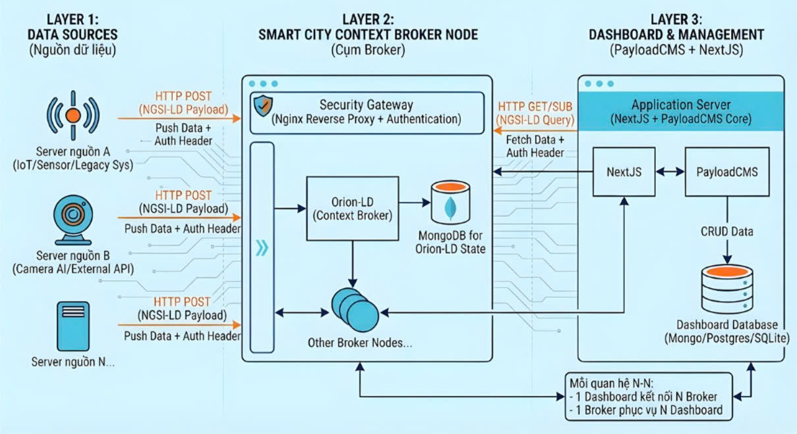

[English](README.md) | [Tiếng Việt](README.vi.md)

# Lego City 

Logo dự án và các badge được đặt ở đây.

**Mô tả**: Lego City là một Smart City Builder sử dụng các FIWARE Enabler và NGSI-LD bên dưới, cùng với PayloadCMS như là phương án thay thế Wirecloud với giao diện hiện đại và có thể tùy chỉnh hoàn toàn. Vì vậy bạn có thể xây dựng nền tảng Smart City của mình một cách nhanh nhất và dễ dàng nhất.

## Tổng quan Kiến trúc

_Kiến trúc hệ thống cho thấy sự tích hợp giữa FIWARE Orion-LD context broker, PayloadCMS dashboard, các update server và các nguồn dữ liệu bên ngoài._

**Screenshot**: Nếu phần mềm có các thành phần trực quan, đặt một screenshot sau phần mô tả; ví dụ:

## Mục lục

- [Tổng quan Kiến trúc](#tổng-quan-kiến-trúc)
- [Cài đặt và Yêu cầu](#cài-đặt-và-yêu-cầu)
- [Hướng dẫn Khởi động Nhanh](#hướng-dẫn-khởi-động-nhanh)
- [Cách sử dụng](#cách-sử-dụng)
- [Vấn đề đã biết](#vấn-đề-đã-biết)
- [Hỗ trợ](#hỗ-trợ)
- [Đóng góp](#đóng-góp)
- [Phát triển](#phát-triển)
- [Giấy phép](#giấy-phép)
- [Người duy trì](#người-duy-trì)
- [Ghi công và Tham khảo](#ghi-công-và-tham-khảo)

## Cài đặt và Yêu cầu

Hướng dẫn chi tiết về cách cài đặt, cấu hình và chạy dự án.
Điều này nên được kiểm tra thường xuyên để đảm bảo độ tin cậy. Hoặc, liên kết đến
một tài liệu _INSTALLATION.md_ riêng.

Ví dụ đơn giản:

`$ pip install PROJECT`

`$ npm install PROJECT --save`

`$ any other command`

## Hướng dẫn Khởi động Nhanh

Mô tả cách nhanh nhất có thể để chạy dự án.

## Cách sử dụng

Hướng dẫn người dùng cách sử dụng phần mềm.
Hãy cụ thể.
Sử dụng định dạng phù hợp khi hiển thị các đoạn code.

## Vấn đề đã biết

Ghi lại bất kỳ thiếu sót đáng kể nào đã biết của phần mềm.

## Hỗ trợ

Hướng dẫn người dùng cách nhận trợ giúp với phần mềm này; điều này có thể bao gồm các liên kết đến issue tracker, wiki, danh sách gửi thư, v.v.

Ví dụ:

_Nếu bạn có câu hỏi, quan ngại, báo cáo lỗi, v.v., vui lòng gửi một issue trong Issue Tracker của repository này._

## Đóng góp

Phần này nên chi tiết tại sao mọi người nên tham gia và mô tả các lĩnh vực chính mà bạn đang
tập trung hiện tại; ví dụ: cố gắng nhận phản hồi về các tính năng, sửa một số lỗi nhất định, xây dựng
các phần quan trọng, v.v.

Hướng dẫn chung về _cách_ đóng góp nên được nêu với liên kết đến [CONTRIBUTING](CONTRIBUTING.md).

## Phát triển

Hướng dẫn chung về cách Phát triển cho dự án nên được nêu với liên kết đến _DEVELOPMENT.md_.

---

## Giấy phép

Ví dụ:
Dự án này được cấp phép theo Giấy phép Creative Commons Zero v1.0 Universal - xem file [LICENSE](LICENSE) để biết chi tiết

---

## Người duy trì

Tên và tài khoản git cho (các) người duy trì chính:

Ví dụ:
_Các_người_duy_trì_

## Ghi công và Tham khảo

Ghi công, tham khảo hoặc thông tin liên quan khác.

Ví dụ:

Cảm ơn đặc biệt đến

- [IEEE Open Source Maintainers Manual](https://opensource.ieee.org/community/manual/)
