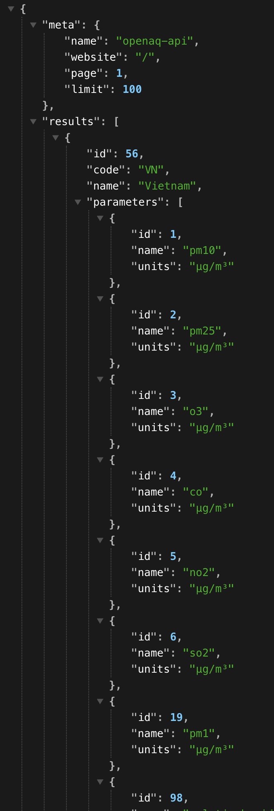
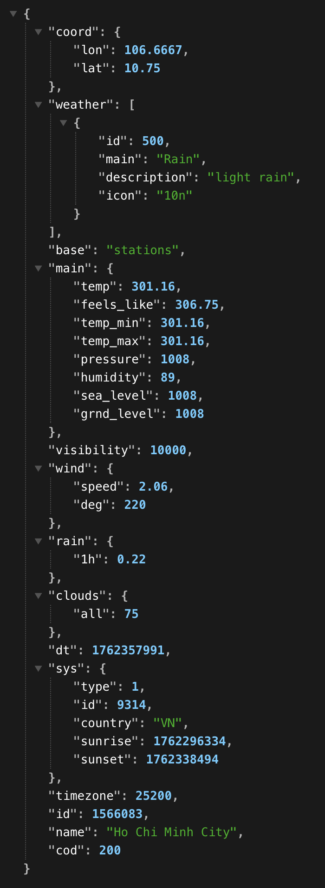

## Call API

### List API

API endpoints:
  - GET  /health
  - POST /api/weather/get (really complex to use :>)
  - GET  /api/weather/city
  - GET  /api/air/locations 
  - GET  /api/air/countries

### Example

```
http://localhost:8080/api/air/countries?country=56
```

example result
``` 

```

```
http://localhost:8080/api/weather/city?q=Ho%20Chi%20Minh%20City
```

example result
```

```