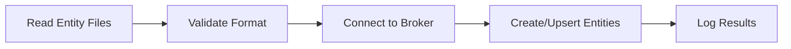
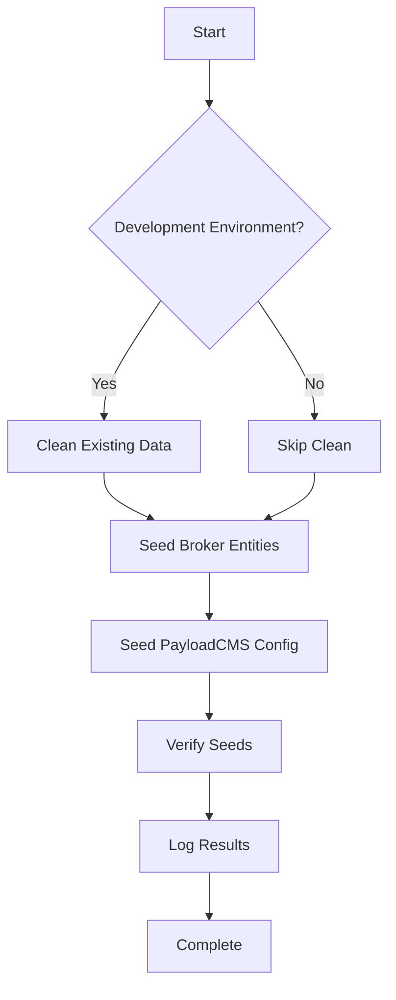

# Seed Data và Example Scenarios

Trang này mô tả cách tạo và sử dụng seed data trong LegoCity cho:

- Context broker (entities)
- PayloadCMS (views, blocks, layers)
- Demos và test cases có thể lặp lại

!!! info "Tại sao Seed Data?"
Seed data cho phép bạn:

    - 🚀 Thiết lập một môi trường smart city thực tế nhanh chóng
    - 🧪 Test các features mới với các scenarios đã biết
    - 📚 Cung cấp các ví dụ sẵn có cho người dùng mới

---

## Mục tiêu của Seed Data

Seed data nên:

### Representative

- ✅ Cover các use cases smart city thực tế (environment, water, mobility)
- ✅ Include các entity types và scenarios đa dạng
- ✅ Demonstrate các features chính của platform

### Safe

- ✅ Không có dữ liệu cá nhân nhạy cảm hoặc thực
- ✅ Giá trị hư cấu nhưng thực tế
- ✅ An toàn cho các demonstrations công khai

### Repeatable

- ✅ Reset và reseed một environment dễ dàng
- ✅ Identifiers ổn định cho docs và tests
- ✅ Nhất quán giữa các environments

!!! tip "Hướng đến Chất lượng hơn Số lượng"
Đừng model một entire city—cung cấp:

    - Một số lượng nhỏ districts hoặc areas
    - Một tập hợp giới hạn sensors và assets
    - Một vài PayloadCMS configurations được chọn kỹ

---

## Các loại Seed Data

LegoCity sử dụng ba categories chính của seed data:

### 1. Broker Entities

=== "NGSI-LD Entities"
NGSI-LD entities đại diện cho dữ liệu thành phố:

    - `WeatherObserved` - Weather stations
    - `AirQualityObserved` - Air quality sensors
    - `ParkingSpot` - Parking facilities
    - `FloodRiskZone` - Flood risk areas
    - `TrafficFlowObserved` - Traffic sensors

=== "Entity Structure"
`json
    {
      "id": "urn:ngsi-ld:WeatherObserved:demo:ctu-campus",
      "type": "WeatherObserved",
      "temperature": {
        "type": "Property",
        "value": 28.5,
        "unitCode": "CEL"
      },
      "location": {
        "type": "GeoProperty",
        "value": {
          "type": "Point",
          "coordinates": [105.7698, 10.0301]
        }
      }
    }
    `

### 2. PayloadCMS Configuration

=== "Collections" - **Layers** - Data sources và styling - **Views** - Map dashboards và layouts - **Blocks** - UI components configuration - **Users** - Demo users và roles (nếu cần)

=== "Example Layer"
`json
    {
      "name": "Weather Stations",
      "slug": "weather-stations",
      "entityType": "WeatherObserved",
      "domain": "environment",
      "mapboxLayerId": "weather-layer",
      "visible": true
    }
    `

### 3. Supporting Reference Data

- 📍 Lists của districts hoặc wards
- 🗺️ Simplified district geometry (polygons)
- 📊 Static lookup tables (codes to names)
- 🔗 Entity relationships và hierarchies

---

## Seeding the Broker

### Conceptual Approach

Broker seeds thường là:

- **JSON files** mô tả entities
- **Scripts** construct và push entities qua broker API

### Entity ID Patterns

Sử dụng stable, meaningful IDs:

```
urn:ngsi-ld:{EntityType}:demo:{location}
```

**Examples:**

| Entity Type | ID Example                                      |
| ----------- | ----------------------------------------------- |
| Weather     | `urn:ngsi-ld:WeatherObserved:demo:ctu-campus`   |
| Parking     | `urn:ngsi-ld:ParkingSpot:demo:downtown-p1`      |
| Flood Zone  | `urn:ngsi-ld:FloodRiskZone:demo:river-district` |

### Suggested Seed Domains

#### Environment Domain

=== "Weather Stations"
Create một vài `WeatherObserved` entities:

    - At points of interest (university, city center, suburbs)
    - With temperature, humidity, precipitation
    - Different times of day hoặc weather conditions

=== "Air Quality"
Create `AirQualityObserved` entities:

    - Near major roads hoặc industrial areas
    - With PM2.5, PM10, NO2 measurements
    - Various quality levels (good, moderate, unhealthy)

#### Water and Flooding Domain

=== "Flood Risk Zones"
Create `FloodRiskZone` entities:

    - Polygons representing vulnerable areas
    - Risk levels (low, medium, high)
    - Near rivers hoặc low-lying areas

=== "Water Quality"
Create `WaterQualityObserved` entities:

    - At river monitoring points
    - pH, turbidity, dissolved oxygen
    - Upstream và downstream comparisons

#### Mobility Domain

=== "Parking"
Create `ParkingSpot` hoặc `ParkingArea` entities:

    - Small number của parking areas (5-10)
    - Available vs total spot numbers
    - Different occupancy levels

=== "Traffic"
Create `TrafficFlowObserved` entities:

    - Major intersections
    - Vehicle count, average speed
    - Different time periods (rush hour, off-peak)

### Running Broker Seed Scripts

Common patterns cho seeding:

=== "Makefile Target"
`bash
    make seed-broker
    `

=== "npm Script"
`bash
    npm run seed:broker
    `

=== "Docker Container"
`bash
    docker compose run --rm seed-broker
    `

### Seed Script Workflow

Typical seed script process:



**Script responsibilities:**

1. Read entity definitions từ `seeds/broker/` directory
2. Validate NGSI-LD format
3. Call broker endpoints để create/upsert entities
4. Log successes và failures
5. Handle errors gracefully

---

## Seeding PayloadCMS

PayloadCMS seed data covers configuration và content:

### Layer Definitions

**Purpose:** Connect broker domains tới map visualization

**Fields:**

- Entity type và domain
- Map layer IDs và styling
- Colors, legends, icons
- Visibility defaults

**Example:**

```typescript title="seeds/payload/layers.ts"
{
  name: "Weather Stations",
  slug: "weather-stations",
  entityType: "WeatherObserved",
  domain: "environment",
  mapboxLayerId: "weather-layer",
  style: {
    circleColor: "#FF6B35",
    circleRadius: 8
  },
  visible: true
}
```

### Views and Layouts

**Purpose:** Define high-level dashboards

**Fields:**

- View name và slug
- Initial map bounds
- Layer references
- Block arrangements

**Example:**

```typescript title="seeds/payload/views.ts"
{
  name: "City Overview",
  slug: "city-overview",
  bounds: [105.7, 10.0, 105.8, 10.1],
  layers: [
    "weather-stations",
    "parking-areas",
    "flood-zones"
  ],
  sidebar: [
    { type: "layerToggle", layers: ["weather-stations"] },
    { type: "kpiCard", metric: "parking:availability" }
  ]
}
```

### Blocks and UI Components

**Purpose:** Configure dashboard widgets

**Types:**

| Block Type    | Purpose                      |
| ------------- | ---------------------------- |
| `layerToggle` | Show/hide map layers         |
| `kpiCard`     | Display key metrics          |
| `chart`       | Time series or distributions |
| `legend`      | Map legend panel             |
| `filter`      | Data filtering controls      |

### Seeding Approach

=== "JSON Fixtures"
Import qua PayloadCMS code:

    ```typescript
    import { seed } from '@payloadcms/payload'
    import layersData from './seeds/layers.json'

    await seed('layers', layersData)
    ```

=== "API Scripts"
Call PayloadCMS REST API:

    ```typescript
    const response = await fetch('/api/layers', {
      method: 'POST',
      headers: { 'Content-Type': 'application/json' },
      body: JSON.stringify(layerData)
    })
    ```

=== "Database Direct"
Insert directly tới database (development only):

    ```typescript
    await db.collection('layers').insertMany(layersData)
    ```

---

## Coordinating Broker and PayloadCMS Seeds

Để đảm bảo seeds hoạt động cùng nhau:

### Broker Entity Requirements

!!! warning "Critical Alignment" - ✅ Use entity types mà PayloadCMS expects - ✅ Use stable, documented IDs - ✅ Place entities within map bounds của seeded views - ✅ Use attribute names matching layer configurations

### PayloadCMS Configuration Requirements

!!! warning "Critical Alignment" - ✅ Refer tới correct entity types và domains - ✅ Use correct Mapbox layer IDs (nếu applicable) - ✅ Define bounding boxes bao gồm seeded entities - ✅ Match attribute names trong filters và displays

### Demo City Profile

**Good practice:** Maintain một documented "demo city profile"

```yaml title="seeds/demo-profile.yml"
name: "Demo Smart City"
location: "Fictional City, Based on Can Tho"
coordinates:
  center: [105.7698, 10.0301]
  bounds: [[105.75, 10.02], [105.79, 10.04]]

districts:
  - id: "ninh-kieu"
    name: "Ninh Kieu District"
    geometry: "polygon..."
  - id: "cai-rang"
    name: "Cai Rang District"
    geometry: "polygon..."

reference_points:
  - name: "CTU Campus"
    coordinates: [105.7698, 10.0301]
  - name: "City Center"
    coordinates: [105.7800, 10.0350]

entities:
  weather:
    - id: "weather:ctu-campus"
      location: "CTU Campus"
      purpose: "Demonstrate temperature visualization"
  parking:
    - id: "parking:downtown-p1"
      location: "City Center"
      purpose: "Show real-time availability"
```

---

## Running All Seeds in Development

### Single Command Seeding

Provide một convenient command để seed everything:

=== "Makefile"
`bash
    make seed-all
    `

    Internally runs:
    ```makefile
    seed-all: clean-data seed-broker seed-payload
    	@echo "All seeds complete!"
    ```

=== "npm Scripts"
`bash
    npm run seed
    `

    In `package.json`:
    ```json
    {
      "scripts": {
        "seed": "npm run seed:clean && npm run seed:broker && npm run seed:payload",
        "seed:clean": "node scripts/clean-data.js",
        "seed:broker": "node scripts/seed-broker.js",
        "seed:payload": "node scripts/seed-payload.js"
      }
    }
    ```

=== "Docker Compose"
`bash
    docker compose run --rm seed
    `

    In `docker-compose.yml`:
    ```yaml
    services:
      seed:
        image: legocity-seed
        depends_on:
          - broker
          - mongodb
        command: ["sh", "-c", "npm run seed:all"]
    ```

### Seed Workflow



### Developer Workflow

!!! example "Typical Usage"
**After cloning the repo:**
`bash
    git clone https://github.com/CTU-SematX/LegoCity.git
    cd LegoCity
    docker compose up -d
    make seed-all  # or npm run seed
    `

    **When testing major changes:**
    ```bash
    make seed-all  # Re-seed clean environment
    npm run dev    # Test changes
    ```

---

## Keeping Seed Data Maintainable

### Best Practices

=== "Keep It Small"
!!! success "Focus on Quality" - Only seed entities needed để demonstrate functionality - Avoid large datasets khó hiểu - 5-10 entities per type thường đủ - Quality examples > Quantity

=== "Version Control"
!!! success "Treat as Code" - Store seeds trong version control - Review changes qua pull requests - Use meaningful commit messages - Tag seeds với version numbers

=== "Documentation"
!!! success "Keep Docs Updated" - Document new entity types - Mention new example views - Update scenario descriptions - Link seeds tới use cases

=== "Versioning"
!!! success "Align with Releases" - Tag seed sets với release versions - Maintain compatibility với docs - Provide migration guides cho seed changes - Archive old seed versions

### Seed File Structure

Recommended organization:

```
seeds/
├── broker/
│   ├── environment/
│   │   ├── weather-stations.json
│   │   └── air-quality.json
│   ├── water/
│   │   └── flood-zones.json
│   └── mobility/
│       ├── parking.json
│       └── traffic.json
├── payload/
│   ├── layers.ts
│   ├── views.ts
│   └── blocks.ts
├── reference/
│   ├── districts.json
│   └── demo-profile.yml
└── README.md
```

---

## Example Scenarios to Support

Design seeds around concrete scenarios:

### Scenario 1: Flooding Risk During Heavy Rainfall

=== "Description"
**Question:** "How does flooding risk evolve during heavy rainfall?"

    **Data needed:**
    - Environment: Weather stations với precipitation data
    - Water: Flood risk zones với varying risk levels
    - Maps: Overlays showing risk zones và rainfall intensity

=== "Entities"
```json
// WeatherObserved with heavy rain
{
"id": "urn:ngsi-ld:WeatherObserved:demo:riverside",
"type": "WeatherObserved",
"precipitation": { "value": 50, "unitCode": "MMT" },
"location": { "coordinates": [105.77, 10.03] }
}

    // FloodRiskZone - high risk
    {
      "id": "urn:ngsi-ld:FloodRiskZone:demo:riverside-district",
      "type": "FloodRiskZone",
      "riskLevel": { "value": "high" },
      "location": { "type": "Polygon", "coordinates": [...] }
    }
    ```

=== "PayloadCMS View"
`typescript
    {
      name: "Flood Monitoring",
      slug: "flood-monitoring",
      layers: [
        "weather-stations",
        "flood-risk-zones",
        "rainfall-intensity"
      ],
      blocks: [
        { type: "legend", layers: ["flood-risk-zones"] },
        { type: "kpiCard", metric: "rainfall:current" }
      ]
    }
    `

### Scenario 2: Parking Availability at Peak Hours

=== "Description"
**Question:** "Which parking areas are near capacity at peak hours?"

    **Data needed:**
    - Mobility: Parking areas với occupancy data
    - UI: KPI blocks và visual indicators
    - Maps: Color-coded parking availability

=== "Entities"
```json
// High occupancy parking
{
"id": "urn:ngsi-ld:ParkingSpot:demo:downtown-p1",
"type": "ParkingSpot",
"availableSpotNumber": { "value": 5 },
"totalSpotNumber": { "value": 100 },
"location": { "coordinates": [105.78, 10.035] }
}

    // Low occupancy parking
    {
      "id": "urn:ngsi-ld:ParkingSpot:demo:suburb-p3",
      "type": "ParkingSpot",
      "availableSpotNumber": { "value": 85 },
      "totalSpotNumber": { "value": 100 },
      "location": { "coordinates": [105.76, 10.025] }
    }
    ```

=== "PayloadCMS View"
`typescript
    {
      name: "Parking Management",
      slug: "parking-management",
      layers: ["parking-areas"],
      blocks: [
        {
          type: "kpiCard",
          title: "Available Spots",
          metric: "parking:total-available"
        },
        {
          type: "chart",
          title: "Occupancy by Hour",
          metric: "parking:occupancy-rate"
        }
      ]
    }
    `

### Scenario 3: Air Quality Near Major Roads

=== "Description"
**Question:** "What is the air quality near major roads?"

    **Data needed:**
    - Environment: Air quality sensors với PM2.5, NO2
    - Reference: Road network overlay
    - UI: Color-coded quality indicators

=== "Entities"
```json
// Poor air quality near highway
{
"id": "urn:ngsi-ld:AirQualityObserved:demo:highway-junction",
"type": "AirQualityObserved",
"pm25": { "value": 75, "unitCode": "GQ" },
"no2": { "value": 120, "unitCode": "GQ" },
"airQualityLevel": { "value": "unhealthy" },
"location": { "coordinates": [105.78, 10.04] }
}

    // Good air quality in park
    {
      "id": "urn:ngsi-ld:AirQualityObserved:demo:city-park",
      "type": "AirQualityObserved",
      "pm25": { "value": 15, "unitCode": "GQ" },
      "no2": { "value": 30, "unitCode": "GQ" },
      "airQualityLevel": { "value": "good" },
      "location": { "coordinates": [105.76, 10.03] }
    }
    ```

=== "PayloadCMS View"
`typescript
    {
      name: "Air Quality Dashboard",
      slug: "air-quality",
      layers: [
        "air-quality-sensors",
        "road-network"
      ],
      blocks: [
        { type: "legend", layers: ["air-quality-sensors"] },
        {
          type: "kpiCard",
          title: "Average PM2.5",
          metric: "airquality:pm25-avg"
        }
      ]
    }
    `

---

## Seed Data Checklist

!!! example "Before Committing Seeds"
**Validation:**

    - [ ] All entity IDs follow naming convention
    - [ ] Coordinates are within demo city bounds
    - [ ] Entity types match PayloadCMS layer configs
    - [ ] Attribute names are consistent
    - [ ] No sensitive hoặc personal data included

    **Testing:**

    - [ ] Seeds run without errors
    - [ ] All entities visible on map
    - [ ] PayloadCMS views load correctly
    - [ ] Blocks display expected data
    - [ ] Scenarios are demonstrable

    **Documentation:**

    - [ ] Seed scenarios documented
    - [ ] Entity IDs listed trong reference
    - [ ] Demo profile updated
    - [ ] README.md includes seed instructions

---

## Summary

!!! success "Key Takeaways"
**Seed data enables rapid environment setup và testing**

    **Three categories:**

    1. **Broker entities** - NGSI-LD entities với stable IDs
    2. **PayloadCMS config** - Layers, views, blocks
    3. **Reference data** - Districts, geometry, lookups

    **Best practices:**

    - Keep seeds small, realistic, và scenario-based
    - Provide single-command seeding (`make seed-all`)
    - Maintain seeds trong version control
    - Document seed scenarios và use cases
    - Align broker entities với PayloadCMS configuration

**Related Pages:**

- [Creating New Blocks](blocks.md)
- [Entity Types and Management](../user-guide/entities.md)
- [Local Development Setup](../installation/local.md)
